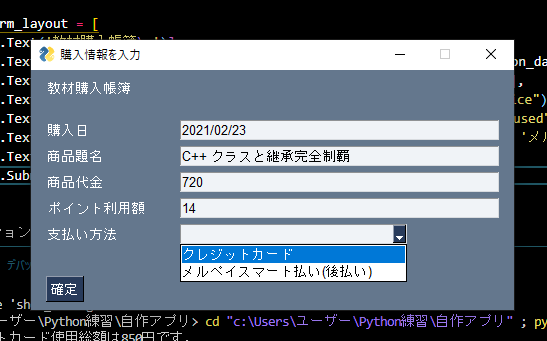
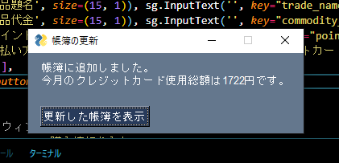
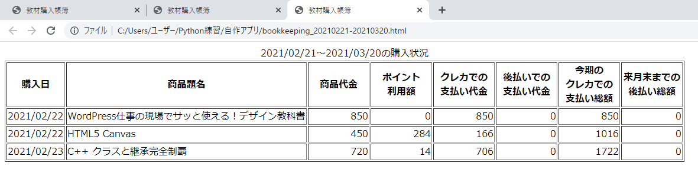

# KeepAccountsGUI

本にどれだけお金を使ったかを計算・把握するための帳簿デスクトップアプリです。

## input_form

プログラム(KeepAccounts.py)の実行直後に現れる画面です。

## Result_page

【確定】ボタンを押すとこの画面に切り替わります。

今月のクレジットカード使用総額を表示することで、自分を戒めます。

## AccountsBook_******21-******20.html

【更新した帳簿を表示】ボタンを押すと、自動作成された帳簿がGoogle Chromeで表示されるようになっています。

******の部分には年・月が入ります。

私の所有しているクレジットカードの締め日が毎月20日なので、21日以降の購入品は新しい月の帳簿に記録されるように設定しています。

## 集計記録ファイル(totalization.dat)

前回までの購入総額と帳簿の最終更新日をJSON形式で記録しておくファイルです。

もちろん自動で作成・編集されます。

また、新しい月の帳簿が作成されるとき、前回までの購入総額は自動でリセットされます。
…リセットされるはずです。実はまだ検証していません…

## プログラム(KeepAccounts.py)の概説

## DATEeditクラス

プログラムの実行日を取得し、その周辺の日時を計算します。

また、日付をHTMLタグで囲むdate_for_HTMLメソッドを提供します。

EntryClerkクラスで使うプロパティ・メソッドのうち、他のプログラムでも使い回しできそうなものを抜き出したクラスです。

## EntryClerkクラス

新たに帳簿に追加したい情報を引数として与えてインスタンス化するだけで、帳簿の作成・更新を行います。

DATEeditクラスを継承し、そのプロパティをもとに帳簿の新規作成・集計記録(totalization.dat)のリセットなどを制御しています。

各メソッドを単体で呼び出して使うことはあまり想定していません。
アクセサも用意していないので、いろいろと修正が必要だと思っています。
